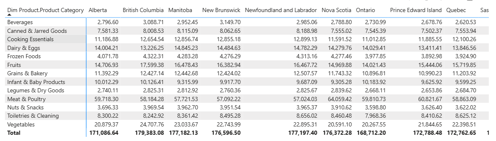
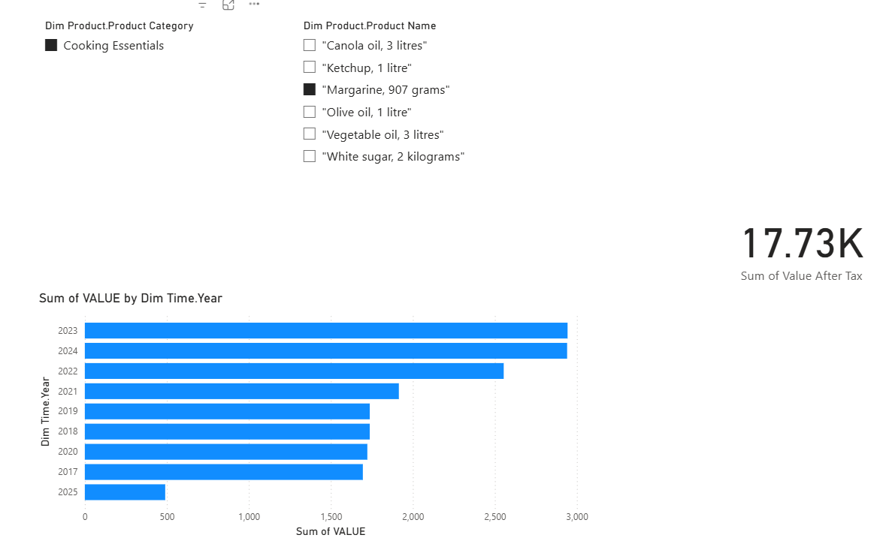
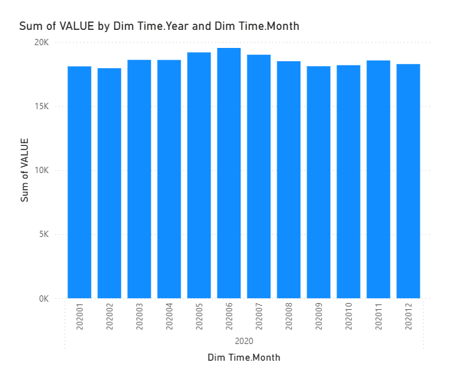
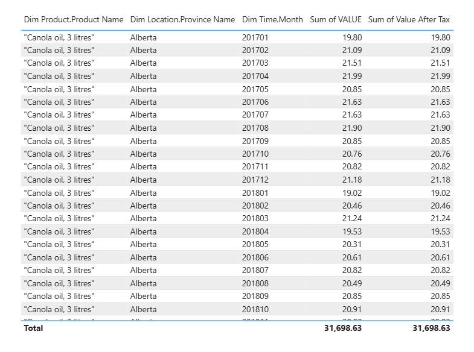

# Retail Prices Data Warehouse & OLAP Solution 🎯

An end-to-end **Analytics Pipeline** delivering a rich Data Warehouse, SSAS cube, and Power BI reporting layer for tracking monthly retail prices across Canadian provinces (2017–2025).

I designed and built a star‑schema data warehouse capturing product price histories with Type 2 Slowly Changing Dimensions, orchestrated ETL via **SSIS**, and implemented a multidimensional cube in **SSAS**. The pipeline transforms raw CSV, Excel, and text files into actionable insights, enabling fast roll‑ups, drill‑downs, and slice‑and‑dice in **Power BI**.

## 🔍 Project Highlights

* **Source-to-Staging ETL (SSIS):**

  * Extracts `monthly_price_data.csv`, `product_metadata.xlsx`, and `geo_tax_mapping.txt` into staging
  * Cleans, de-duplicates, and derives `Date_ID` from year/month
  * Performs lookups to translate natural keys into surrogate keys
  * Loads staging data into fact and dimension tables using SCD Type 2 logic for historical tracking

* **Data Warehouse Design:**

  * Star schema with central **Fact Price** table and **Date**, **Product**, **Location** dimensions
  * Surrogate key strategy for performance and immutability
  * Comprehensive SCD handling (Types 0, 1, 2) for attribute versioning

* **Multidimensional Cube (SSAS):**

  * Data Sources & Views defined against the DW
  * Dimensions with hierarchies for intuitive OLAP operations (roll‑up, drill‑down, slice, dice, pivot)
  * Price measure group for rapid aggregation
  * Supports MOLAP, ROLAP, and HOLAP storage modes for flexible performance

* **Interactive Reports (Power BI):**

  * Live & Import modes with cascading slicers, matrix visuals, and drill‑through pages
  * Dynamic visuals: cards, clustered bar/column charts, and pivot‑style matrices
  * Enables executives to explore pricing trends at province, product, and time granularity

Check out,

  
  

  
  

## 💡 Key Takeaways

* Orchestrated complex ETL workflows with SSIS to ensure data quality and historical accuracy
* Designed a scalable star schema optimized for analytical queries
* Leveraged SSAS cube design to pre-aggregate data for sub-second OLAP interactions
* Delivered user-centric Power BI reports that empower decision-makers with self-service analytics

> Licensed under the [MIT License](LICENSE)
